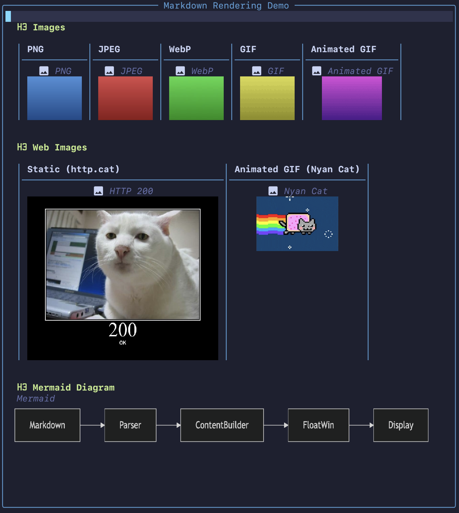

# md-render.nvim

[日本語版はこちら](#日本語)

A Markdown rendering engine for Neovim. Transforms raw Markdown into richly highlighted, interactive content — right inside your editor. Supports floating windows, tab views, and a pager mode for `less`-like usage from the command line.

<table>
<tr>
<td></td>
<td></td>
</tr>
<tr>
<td align="center"><em>Inline formatting, tables, callouts, code blocks, and CJK line-breaking</em></td>
<td align="center"><em>Local/web images (including animated GIF) and Mermaid diagrams</em></td>
</tr>
</table>

## Highlights

- **Rich inline formatting** — bold, strikethrough, inline code, links, Obsidian `==highlight==`, all rendered in-place
- **Tables** — box-drawing borders, column alignment, proportional sizing, and inline formatting within cells
- **Callouts & folds** — GitHub and Obsidian alert types with colored borders, icons, and click-to-toggle folding
- **Code blocks** — fenced blocks with treesitter syntax highlighting; expandable when truncated
- **Images** — local and web images (PNG, JPEG, WebP, GIF, animated GIF) displayed inline via terminal graphics protocol
- **Mermaid diagrams** — rendered as images inline
- **CJK-aware word wrapping** — JIS X 4051 kinsoku shori + optional [BudouX](https://github.com/google/budoux) phrase segmentation via [budoux.lua](https://github.com/delphinus/budoux.lua)
- **Clickable links** — mouse click to open URLs; OSC 8 hyperlink support for compatible terminals
- **`<details>` support** — collapsible sections with click-to-toggle, respecting the `open` attribute
- **Library API** — use the rendering engine programmatically from your own plugins

## Requirements

- Neovim >= 0.10
- A terminal that supports the [Kitty graphics protocol](https://sw.kovidgoyal.net/kitty/graphics-protocol/) (required for inline images):
  - [WezTerm](https://wezfurlong.org/wezterm/)
  - [Kitty](https://sw.kovidgoyal.net/kitty/)
  - [Ghostty](https://ghostty.org/)

### Optional dependencies

| Dependency | Purpose | Fallback |
|---|---|---|
| [curl](https://curl.se/) | Download web images | Custom function via `set_download_fn()` |
| [FFmpeg](https://ffmpeg.org/) (`ffmpeg` / `ffprobe`) | JPEG/WebP → PNG conversion, animated GIF frame extraction | Falls back to ImageMagick |
| [ImageMagick](https://imagemagick.org/) (`magick`) | Same as above | `sips` (macOS) handles static conversion; animated GIF requires ffmpeg or magick |
| [Mermaid CLI](https://github.com/mermaid-js/mermaid-cli) (`mmdc`) | Render Mermaid diagrams as images | Falls back to `npx -y @mermaid-js/mermaid-cli` |
| [budoux.lua](https://github.com/delphinus/budoux.lua) | CJK phrase-level line breaking (BudouX) | Character-level splitting (kinsoku rules still apply) |
| Treesitter parsers | Syntax highlighting in code blocks | Code blocks rendered without highlighting |
| [nvim-web-devicons](https://github.com/nvim-tree/nvim-web-devicons) or [mini.icons](https://github.com/echasnovski/mini.icons) | File type icons in code block headers | Built-in icon table |

For image format conversion and animated GIF support, the plugin tries tools in this order:

| Use case | 1st | 2nd | 3rd |
|---|---|---|---|
| Static image conversion (JPEG/WebP → PNG) | `sips` (macOS) | `ffmpeg` | `magick` |
| Animated GIF frame extraction | `ffmpeg` | `magick` | — |

## Installation

### lazy.nvim

```lua
{
  "delphinus/md-render.nvim",
  version = "*",
  dependencies = {
    { "nvim-tree/nvim-web-devicons", version = "*" }, -- optional: file type icons in code blocks
    { "delphinus/budoux.lua", version = "*" }, -- optional: CJK phrase-level line breaking
  },
  keys = {
    { "<leader>mp", "<Plug>(md-render-preview)",     desc = "Markdown preview (toggle)" },
    { "<leader>mt", "<Plug>(md-render-preview-tab)", desc = "Markdown preview in tab (toggle)" },
    { "<leader>md", "<Plug>(md-render-demo)",        desc = "Markdown render demo" },
  },
}
```

## Keymaps

The plugin provides `<Plug>` mappings but does **not** set any default keybindings. Map them yourself:

```lua
vim.keymap.set("n", "<leader>mp", "<Plug>(md-render-preview)",     { desc = "Markdown preview (toggle)" })
vim.keymap.set("n", "<leader>mt", "<Plug>(md-render-preview-tab)", { desc = "Markdown preview in tab (toggle)" })
vim.keymap.set("n", "<leader>md", "<Plug>(md-render-demo)",        { desc = "Markdown render demo" })
```

| `<Plug>` mapping | Description |
|---|---|
| `<Plug>(md-render-preview)` | Toggle a floating preview window for the current Markdown buffer |
| `<Plug>(md-render-preview-tab)` | Toggle a tab preview for the current Markdown buffer |
| `<Plug>(md-render-demo)` | Show a demo window with all supported Markdown notations |

## Commands

| Command | Description |
|---|---|
| `:MdRender` | Toggle a floating preview window |
| `:MdRenderTab` | Toggle a tab preview |
| `:MdRenderPager` | Pager mode — full-screen, no chrome, `q` to quit Neovim |
| `:MdRenderDemo` | Show a demo window with all supported Markdown notations |

### Pager mode

Use `MdRenderPager` to view Markdown files like `less`:

```bash
nvim +MdRenderPager README.md
```

Add a shell alias for convenience:

```bash
alias mdless='nvim +MdRenderPager'
mdless README.md
```

## Usage

### As a Library

Use the rendering engine to build highlighted content programmatically:

```lua
local md = require("md-render")

-- Render a single line of markdown
local text, highlights, links = md.Markdown.render("**bold** and [link](https://example.com)")

-- Build full document content
local ContentBuilder = md.ContentBuilder
local b = ContentBuilder.new()
b:render_document(lines, {
  max_width = 80,
  indent = "  ",
  repo_base_url = "https://github.com/user/repo",
  autolinks = {
    { key_prefix = "JIRA-", url_template = "https://jira.example.com/browse/JIRA-<num>" },
  },
})
local content = b:result()

-- Apply to a buffer
local buf = vim.api.nvim_create_buf(false, true)
local ns = vim.api.nvim_create_namespace("my_ns")
md.display_utils.apply_content_to_buffer(buf, ns, content)
```

## License

MIT — see [LICENSE](LICENSE).

---

# 日本語

Neovim で Markdown をリッチにレンダリングするエンジンです。生の Markdown テキストをハイライト付きのインタラクティブなコンテンツに変換して、エディタ内で表示します。フローティングウィンドウ、タブ表示、コマンドラインからの `less` ライクなページャーモードに対応しています。

<table>
<tr>
<td></td>
<td></td>
</tr>
<tr>
<td align="center"><em>インライン書式、テーブル、コールアウト、コードブロック、CJK 折り返し</em></td>
<td align="center"><em>ローカル/Web 画像（アニメーション GIF 含む）と Mermaid ダイアグラム</em></td>
</tr>
</table>

## 主な機能

- **リッチなインライン書式** — 太字、取り消し線、インラインコード、リンク、Obsidian `==highlight==` をその場でレンダリング
- **テーブル** — 罫線文字による描画、列アラインメント、比例サイズ調整、セル内インライン書式
- **コールアウト & 折りたたみ** — GitHub / Obsidian のアラートタイプに対応。色付きボーダー・アイコン・クリックで折りたたみ切り替え
- **コードブロック** — treesitter シンタックスハイライト付きフェンスコードブロック。省略時はクリックで展開
- **画像** — ローカルおよび Web 画像（PNG, JPEG, WebP, GIF, アニメーション GIF）をターミナルグラフィクスプロトコルでインライン表示
- **Mermaid ダイアグラム** — 画像としてインライン表示
- **CJK 対応ワードラップ** — JIS X 4051 禁則処理 + [budoux.lua](https://github.com/delphinus/budoux.lua) によるオプションのフレーズ分割
- **クリック可能リンク** — マウスクリックで URL を開く。対応ターミナルでは OSC 8 ハイパーリンク
- **`<details>` 対応** — クリックで折りたたみ可能なセクション。`open` 属性にも対応
- **ライブラリ API** — レンダリングエンジンを自作プラグインからプログラム的に利用可能

## 必要要件

- Neovim >= 0.10
- [Kitty graphics protocol](https://sw.kovidgoyal.net/kitty/graphics-protocol/) に対応したターミナル（画像のインライン表示に必要）：
  - [WezTerm](https://wezfurlong.org/wezterm/)
  - [Kitty](https://sw.kovidgoyal.net/kitty/)
  - [Ghostty](https://ghostty.org/)

### オプション依存

| 依存 | 用途 | フォールバック |
|---|---|---|
| [curl](https://curl.se/) | Web 画像のダウンロード | `set_download_fn()` でカスタム関数を指定可 |
| [FFmpeg](https://ffmpeg.org/) (`ffmpeg` / `ffprobe`) | JPEG/WebP → PNG 変換、アニメーション GIF のフレーム展開 | ImageMagick にフォールバック |
| [ImageMagick](https://imagemagick.org/) (`magick`) | 同上 | macOS では `sips` が静止画変換を処理。アニメーション GIF には ffmpeg か magick が必要 |
| [Mermaid CLI](https://github.com/mermaid-js/mermaid-cli) (`mmdc`) | Mermaid ダイアグラムを画像として描画 | `npx -y @mermaid-js/mermaid-cli` にフォールバック |
| [budoux.lua](https://github.com/delphinus/budoux.lua) | CJK フレーズ単位の改行（BudouX） | 1文字ずつ分割（禁則処理は維持） |
| Treesitter パーサー | コードブロックのシンタックスハイライト | ハイライトなしで表示 |
| [nvim-web-devicons](https://github.com/nvim-tree/nvim-web-devicons) または [mini.icons](https://github.com/echasnovski/mini.icons) | コードブロックヘッダのファイルタイプアイコン | 内蔵アイコンテーブル |

画像フォーマット変換とアニメーション GIF のサポートでは、以下の優先順位でツールを検索します：

| ユースケース | 1st | 2nd | 3rd |
|---|---|---|---|
| 静止画変換（JPEG/WebP → PNG） | `sips`（macOS） | `ffmpeg` | `magick` |
| アニメーション GIF フレーム展開 | `ffmpeg` | `magick` | — |

## インストール

### lazy.nvim

```lua
{
  "delphinus/md-render.nvim",
  version = "*",
  dependencies = {
    { "nvim-tree/nvim-web-devicons", version = "*" }, -- optional: file type icons in code blocks
    { "delphinus/budoux.lua", version = "*" }, -- optional: CJK phrase-level line breaking
  },
  keys = {
    { "<leader>mp", "<Plug>(md-render-preview)",     desc = "Markdown preview (toggle)" },
    { "<leader>mt", "<Plug>(md-render-preview-tab)", desc = "Markdown preview in tab (toggle)" },
    { "<leader>md", "<Plug>(md-render-demo)",        desc = "Markdown render demo" },
  },
}
```

## キーマップ

このプラグインは `<Plug>` マッピングを提供しますが、デフォルトのキーバインドは設定**しません**。自分でマッピングしてください：

```lua
vim.keymap.set("n", "<leader>mp", "<Plug>(md-render-preview)",     { desc = "Markdown preview (toggle)" })
vim.keymap.set("n", "<leader>mt", "<Plug>(md-render-preview-tab)", { desc = "Markdown preview in tab (toggle)" })
vim.keymap.set("n", "<leader>md", "<Plug>(md-render-demo)",        { desc = "Markdown render demo" })
```

| `<Plug>` マッピング | 説明 |
|---|---|
| `<Plug>(md-render-preview)` | 現在の Markdown バッファのフローティングプレビューをトグル |
| `<Plug>(md-render-preview-tab)` | 現在の Markdown バッファのタブプレビューをトグル |
| `<Plug>(md-render-demo)` | 対応する全 Markdown 記法のデモウィンドウを表示 |

## コマンド

| コマンド | 説明 |
|---|---|
| `:MdRender` | フローティングプレビューをトグル |
| `:MdRenderTab` | タブプレビューをトグル |
| `:MdRenderPager` | ページャーモード — フルスクリーン、装飾なし、`q` で Neovim 終了 |
| `:MdRenderDemo` | 対応する全 Markdown 記法のデモウィンドウを表示 |

### ページャーモード

`MdRenderPager` を使うと Markdown ファイルを `less` のように閲覧できます：

```bash
nvim +MdRenderPager README.md
```

シェルエイリアスを設定すると便利です：

```bash
alias mdless='nvim +MdRenderPager'
mdless README.md
```

## 使い方

### ライブラリとして使う

レンダリングエンジンをプログラムから利用してハイライト付きコンテンツを構築できます：

```lua
local md = require("md-render")

-- 1 行の Markdown をレンダリング
local text, highlights, links = md.Markdown.render("**bold** and [link](https://example.com)")

-- ドキュメント全体のコンテンツを構築
local ContentBuilder = md.ContentBuilder
local b = ContentBuilder.new()
b:render_document(lines, {
  max_width = 80,
  indent = "  ",
  repo_base_url = "https://github.com/user/repo",
  autolinks = {
    { key_prefix = "JIRA-", url_template = "https://jira.example.com/browse/JIRA-<num>" },
  },
})
local content = b:result()

-- バッファに適用
local buf = vim.api.nvim_create_buf(false, true)
local ns = vim.api.nvim_create_namespace("my_ns")
md.display_utils.apply_content_to_buffer(buf, ns, content)
```

## ライセンス

MIT — [LICENSE](LICENSE) を参照。
