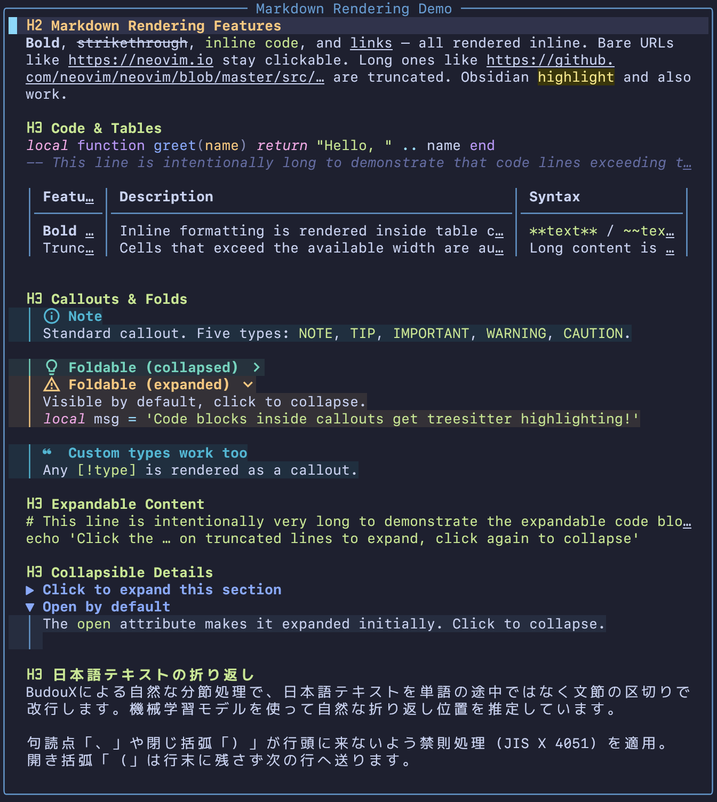

# md-render.nvim

[日本語版はこちら / Japanese version](README.ja.md) — Full Japanese/CJK support with kinsoku shori and BudouX phrase segmentation.

A Markdown rendering engine for Neovim. Transforms raw Markdown into richly highlighted, interactive content — right inside your editor. Supports floating windows, tab views, and a pager mode for `less`-like usage from the command line.

<figure align="center">
  
</figure>

## Highlights

- **Rich inline formatting** — bold, strikethrough, inline code, links, Obsidian `==highlight==`, all rendered in-place
- **Tables** — box-drawing borders, column alignment, proportional sizing, and inline formatting within cells
- **Callouts & folds** — GitHub and Obsidian alert types with colored borders, icons, and click-to-toggle folding
- **Code blocks** — fenced blocks with treesitter syntax highlighting; expandable when truncated
- **Images** — local and web images (PNG, JPEG, WebP, GIF, animated GIF) displayed inline via terminal graphics protocol
- **Video** — local and web video (MP4, WebM, MOV, AVI, MKV, M4V) played as animated frames inline
- **Mermaid diagrams** — rendered as images inline
- **CJK-aware word wrapping** — JIS X 4051 kinsoku shori + optional [BudouX](https://github.com/google/budoux) phrase segmentation via [budoux.lua](https://github.com/delphinus/budoux.lua)
- **Clickable links** — mouse click to open URLs; OSC 8 hyperlink support for compatible terminals
- **`<details>` support** — collapsible sections with click-to-toggle, respecting the `open` attribute
- **Library API** — use the rendering engine programmatically from your own plugins

<figure align="center">
  
  <figcaption><em>Static preview: inline formatting, tables, callouts, code blocks, and CJK line-breaking</em></figcaption>
</figure>

## Try it yourself

The repo bundles a showcase Markdown file demonstrating every feature. After cloning, view it with the pager:

```bash
git clone https://github.com/delphinus/md-render.nvim
cd md-render.nvim
nvim +"MdRender pager" assets/showcase.md
```

Or, once the plugin is installed, run `:MdRender demo` to see a built-in demo of every supported notation.

## Requirements

- Neovim >= 0.12 (uses `vim.api.nvim_ui_send` for terminal writes)
- For inline images and video: a terminal supporting the [Kitty graphics protocol](https://sw.kovidgoyal.net/kitty/graphics-protocol/).
  Verified on [WezTerm](https://wezfurlong.org/wezterm/), [Kitty](https://sw.kovidgoyal.net/kitty/), and [Ghostty](https://ghostty.org/) (macOS/Linux).

<details>
<summary><strong>Optional dependencies</strong></summary>

| Dependency | Purpose | Fallback |
|---|---|---|
| [curl](https://curl.se/) | Download web images and video | Custom function via `set_download_fn()` |
| [FFmpeg](https://ffmpeg.org/) (`ffmpeg` / `ffprobe`) | JPEG/WebP → PNG conversion, animated GIF / video frame extraction | Falls back to ImageMagick (images only; video requires ffmpeg) |
| [ImageMagick](https://imagemagick.org/) (`magick`) | JPEG/WebP → PNG, animated GIF frame extraction | `sips` (macOS) handles static conversion; animated GIF requires ffmpeg or magick |
| [Mermaid CLI](https://github.com/mermaid-js/mermaid-cli) (`mmdc`) | Render Mermaid diagrams as images | Falls back to `npx -y @mermaid-js/mermaid-cli` |
| [budoux.lua](https://github.com/delphinus/budoux.lua) | CJK phrase-level line breaking (BudouX) | Character-level splitting (kinsoku rules still apply) |
| Treesitter parsers | Syntax highlighting in code blocks | Code blocks rendered without highlighting |
| [nvim-web-devicons](https://github.com/nvim-tree/nvim-web-devicons) or [mini.icons](https://github.com/echasnovski/mini.icons) | File type icons in code block headers | Built-in icon table |

For image/video format conversion and animation support, the plugin tries tools in this order:

| Use case | 1st | 2nd | 3rd |
|---|---|---|---|
| Static image conversion (JPEG/WebP → PNG) | `sips` (macOS) | `ffmpeg` | `magick` |
| Animated GIF frame extraction | `ffmpeg` | `magick` | — |
| Video frame extraction | `ffmpeg` | — | — |

</details>

## Installation

### lazy.nvim

```lua
{
  "delphinus/md-render.nvim",
  version = "*",
  dependencies = {
    { "nvim-tree/nvim-web-devicons", version = "*" }, -- optional: file type icons in code blocks
    { "delphinus/budoux.lua", version = "*" }, -- optional: CJK phrase-level line breaking
  },
  keys = {
    { "<leader>mp", "<Plug>(md-render-preview)",     desc = "Markdown preview (toggle)" },
    { "<leader>mt", "<Plug>(md-render-preview-tab)", desc = "Markdown preview in tab (toggle)" },
    { "<leader>md", "<Plug>(md-render-demo)",        desc = "Markdown render demo" },
  },
}
```

### vim.pack (Neovim 0.12+)

```lua
vim.pack.add({
  "https://github.com/delphinus/md-render.nvim",
  -- optional:
  "https://github.com/nvim-tree/nvim-web-devicons",
  "https://github.com/delphinus/budoux.lua",
})
```

### mini.deps

```lua
local add = MiniDeps.add
add({
  source = "delphinus/md-render.nvim",
  depends = {
    "nvim-tree/nvim-web-devicons", -- optional
    "delphinus/budoux.lua",        -- optional
  },
})
```

## Comparison with similar plugins

<details>
<summary><strong>Why not other Markdown previewers?</strong></summary>

- **[markdown-preview.nvim](https://github.com/iamcco/markdown-preview.nvim)** — Excellent for true browser-quality rendering, but requires a browser context. md-render runs entirely inside the terminal.
- **[render-markdown.nvim](https://github.com/MeanderingProgrammer/render-markdown.nvim)** — Beautiful in-buffer rendering, but modifies the editing buffer itself. md-render keeps your editing buffer untouched and renders into a separate floating/tab window or pager view.
- **[mcat](https://github.com/Skardyy/mcat)** — Closest in spirit (a pure-terminal Markdown renderer), but lacks complex layout features like auto-folding tables, click-to-toggle folds, and CJK word wrapping.

md-render.nvim aims to be a dedicated previewer that runs entirely in the terminal, with rich layout support and first-class CJK handling.

</details>

## Keymaps

The plugin provides `<Plug>` mappings but does **not** set any default keybindings. Map them yourself:

```lua
vim.keymap.set("n", "<leader>mp", "<Plug>(md-render-preview)",     { desc = "Markdown preview (toggle)" })
vim.keymap.set("n", "<leader>mt", "<Plug>(md-render-preview-tab)", { desc = "Markdown preview in tab (toggle)" })
vim.keymap.set("n", "<leader>md", "<Plug>(md-render-demo)",        { desc = "Markdown render demo" })
```

| `<Plug>` mapping | Description |
|---|---|
| `<Plug>(md-render-preview)` | Toggle a floating preview window for the current Markdown buffer |
| `<Plug>(md-render-preview-tab)` | Toggle a tab preview for the current Markdown buffer |
| `<Plug>(md-render-toggle)` | Toggle the current window between source and render mode in place |
| `<Plug>(md-render-auto)` | **[experimental]** Toggle auto mode (render outside Insert) for the current buffer |
| `<Plug>(md-render-split)` | Open a split showing source and rendered Markdown |
| `<Plug>(md-render-demo)` | Show a demo window with all supported Markdown notations |

## Commands

The plugin exposes a single `:MdRender` command with subcommands:

| Command | Description |
|---|---|
| `:MdRender` | Floating preview window (alias of `:MdRender float`) |
| `:MdRender float` | Toggle a floating preview window |
| `:MdRender tab` | Toggle a tab preview |
| `:MdRender toggle` | Toggle the current window between source and render mode in place |
| `:MdRender split` | Open a split showing source and rendered Markdown (honours `:vert`, `:tab`, `:topleft`, `:botright`) |
| `:MdRender auto [on\|off\|toggle]` | **[experimental]** Auto-toggle source/render based on Insert mode (per buffer) |
| `:MdRender pager` | Pager mode — full-screen, no chrome, `q` to quit Neovim |
| `:MdRender demo` | Show a demo window with all supported Markdown notations |

Tab completion lists the subcommands for the first arg, and `on` / `off` / `toggle` after `auto`.

> **Backwards compatibility.** The legacy top-level commands (`:MdRenderTab`, `:MdRenderToggle`, `:MdRenderSplit`, `:MdRenderAuto`, `:MdRenderPager`, `:MdRenderDemo`) still work and forward to the new dispatcher. They print a one-shot deprecation warning per Neovim session and will be removed in a future major version.

### In-place toggle

`:MdRender toggle` swaps the current window between the source Markdown buffer and a rendered view of it — without opening a new tab or floating window. This is designed for split layouts where you want, for example, code in one split and the rendered README in the other.

```vim
:vsplit README.md
:MdRender toggle
```

Behavior:

- The render buffer is **read-only** and reused across toggles (one render buffer per source).
- When the same source is shown in multiple windows, only the invoking window swaps; edits from other windows are reflected on the next toggle into render mode.
- Cursor position round-trips between source and render via the source-line mapping.
- `number`, `relativenumber`, and `list` are turned off on render-mode windows. The originals are stashed on the window and restored when toggling back to source.
- Inside render mode, `q` / `<Esc>` / `<CR>` are **not** bound to close — call `:MdRender toggle` again to return to source mode. `<LeftMouse>` still toggles folds, expands regions, and opens links.

### Auto-toggle on Insert mode (experimental)

> **Experimental.** This feature is new and the UX may change. Please report issues or rough edges.

`:MdRender auto on` keeps the current buffer in render mode while in Normal mode and swaps back to source automatically when you start editing. Pass `off` to disable, or call `:MdRender auto` (or `:MdRender auto toggle`) to toggle. To opt every Markdown buffer in:

```vim
autocmd FileType markdown silent! MdRender auto on
```

See `:help :MdRender-auto` for behavior details — the `i` / `I` / `a` / `A` / `o` / `O` remaps, `:w` forwarding, and the editing operations that are blocked on the read-only render buffer.

### Source/render split

<figure>
  
  <figcaption><em>Source/render split — edits propagate live, including inline images</em></figcaption>
</figure>

`:MdRender split` opens a split showing the source buffer and the rendered view together. Direction follows standard Vim split modifiers:

- `:MdRender split` — horizontal split
- `:vert MdRender split` — vertical split (typical "README + code" layout)
- `:tab MdRender split` — split inside a new tab
- `:topleft MdRender split` — place at the top
- `:botright MdRender split` — place at the bottom

Edits to the source propagate live, and cursor/scroll position is synchronized in both directions. See `:help :MdRender-split` for full behavior and the inline-image limitation.

### Pager mode

<figure>
  
  <figcaption><em>Pager mode — browse Markdown like <code>less</code></em></figcaption>
</figure>

Use `:MdRender pager` to view Markdown files like `less`:

```bash
nvim +"MdRender pager" README.md
```

Add a shell alias for convenience:

```bash
alias mdless='nvim +"MdRender pager"'
mdless README.md
```

## Telescope Integration

<figure>
  
  <figcaption><em>Telescope previewer with md-render</em></figcaption>
</figure>

### Previewer

`require("md-render.telescope").previewer()` creates a previewer that can be
passed to any [telescope.nvim](https://github.com/nvim-telescope/telescope.nvim)
picker — builtin, extension, or custom:

```lua
local previewer = require("md-render.telescope").previewer()

require("telescope.builtin").find_files({ previewer = previewer })
require("telescope").extensions.egrepify.egrepify({ previewer = previewer })
```

The previewer automatically handles three kinds of files:

| File type | Behavior |
|---|---|
| Markdown (`.md`, `.markdown`) | Full md-render rendering with highlights, links, and images |
| Image / Video (PNG, JPEG, WebP, GIF, MP4, ...) | Inline display via Kitty graphics protocol |
| Other files | Falls back to telescope's default previewer with syntax highlighting |

For grep-based pickers, the preview scrolls to the matched line.

### `:Telescope md_render` Extension

A shortcut for builtin pickers. Wraps `telescope.builtin` pickers with the
md-render previewer. All arguments are passed through:

```vim
:Telescope md_render find_files
:Telescope md_render live_grep cwd=~/notes
:Telescope md_render grep_string search=TODO
```

## Snacks.nvim Integration

`require("md-render.snacks").preview()` creates a preview function for
[snacks.nvim](https://github.com/folke/snacks.nvim) pickers. It handles the
same three file types as the telescope previewer (Markdown, image/video, and
fallback).

Configure it globally to apply to all pickers:

```lua
require("snacks").setup({
  picker = {
    preview = require("md-render.snacks").preview(),
  },
})
```

Or per-source:

```lua
require("snacks").setup({
  picker = {
    sources = {
      files = { preview = require("md-render.snacks").preview() },
      grep = { preview = require("md-render.snacks").preview() },
    },
  },
})
```

## FAQ / Troubleshooting

<details>
<summary><strong>Images don't show — only their alt text or filenames appear</strong></summary>

Inline image display requires a terminal that supports the [Kitty graphics protocol](https://sw.kovidgoyal.net/kitty/graphics-protocol/). Verify you're using **WezTerm**, **Kitty**, or **Ghostty**. tmux and other multiplexers may strip the image escape sequences unless explicitly configured to pass them through.

</details>

<details>
<summary><strong>Videos appear as a single static frame</strong></summary>

Video frame extraction requires `ffmpeg` to be installed and available in `$PATH`. Without it, the plugin falls back to displaying just the first frame as a still image. Install it via your package manager (e.g. `brew install ffmpeg`).

</details>

<details>
<summary><strong>Mermaid diagrams don't render</strong></summary>

Mermaid rendering requires the `mmdc` binary from [@mermaid-js/mermaid-cli](https://github.com/mermaid-js/mermaid-cli). If `mmdc` isn't installed globally, the plugin falls back to `npx -y @mermaid-js/mermaid-cli`, which is significantly slower on first invocation. Install it globally with `npm install -g @mermaid-js/mermaid-cli` for faster rendering.

</details>

<details>
<summary><strong>Japanese text wrapping looks unnatural</strong></summary>

By default, md-render applies JIS X 4051 kinsoku shori (forbidden line-break rules) at the character level. For phrase-level segmentation that respects natural word boundaries in Japanese, install [budoux.lua](https://github.com/delphinus/budoux.lua) — the plugin will automatically detect and use it.

</details>

<details>
<summary><strong>Code blocks have no syntax highlighting</strong></summary>

Syntax highlighting requires the corresponding treesitter parser to be installed. For example, to highlight Lua code blocks, install the `lua` parser via `:TSInstall lua` (with [nvim-treesitter](https://github.com/nvim-treesitter/nvim-treesitter)) or via Neovim 0.11+'s built-in parser management.

</details>

## Usage as a library

<details>
<summary><strong>Programmatic API</strong></summary>

Use the rendering engine to build highlighted content programmatically:

```lua
local md = require("md-render")

-- Render a single line of markdown
local text, highlights, links = md.Markdown.render("**bold** and [link](https://example.com)")

-- Build full document content
local ContentBuilder = md.ContentBuilder
local b = ContentBuilder.new()
b:render_document(lines, {
  max_width = 80,
  indent = "  ",
  repo_base_url = "https://github.com/user/repo",
  autolinks = {
    { key_prefix = "JIRA-", url_template = "https://jira.example.com/browse/JIRA-<num>" },
  },
})
local content = b:result()

-- Apply to a buffer
local buf = vim.api.nvim_create_buf(false, true)
local ns = vim.api.nvim_create_namespace("my_ns")
md.display_utils.apply_content_to_buffer(buf, ns, content)

-- Display images (requires a Kitty Graphics Protocol compatible terminal)
-- Images are automatically cleaned up when the window is closed.
local win = vim.api.nvim_get_current_win()
md.display_utils.setup_images(win, content, ns)
```

</details>

## Development

### Running Tests

```bash
make test
```

This runs all `tests/*_test.lua` files via `nvim --headless`. New test files matching the `*_test.lua` pattern are picked up automatically.

## License

MIT — see [LICENSE](LICENSE).
