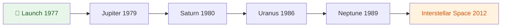

# The Solar System — A Quick Guide 🪐

The Solar System formed approximately **4.6 billion years ago** from the
gravitational collapse of a giant interstellar molecular cloud. It consists of
the Sun, eight planets, dwarf planets, and countless smaller bodies.

## The Inner Planets

| Planet | Diameter (km) | Distance from Sun (AU) | Moons | Notable Feature |
|--------|---------------|------------------------|-------|-----------------|
| **Mercury** | 4,879 | 0.39 | 0 | Extreme temperature swings |
| **Venus** | 12,104 | 0.72 | 0 | ~~Habitable~~ Runaway greenhouse |
| **Earth** | 12,756 | 1.00 | 1 | The only known life |
| **Mars** | 6,792 | 1.52 | 2 | `Olympus Mons` — tallest volcano |

> [!TIP] Did you know?
> A day on Venus (243 Earth days) is **longer** than a year on Venus (225 Earth days).
> Venus rotates in the *opposite direction* to most planets.

## Voyager Mission Timeline



## Atmosphere Composition

```python
# Atmospheric composition by volume (%)
atmospheres = {
    "Earth":   {"N₂": 78.1, "O₂": 20.9, "Ar": 0.93, "CO₂": 0.04},
    "Mars":    {"CO₂": 95.3, "N₂": 2.7,  "Ar": 1.6,  "O₂": 0.13},
    "Venus":   {"CO₂": 96.5, "N₂": 3.5,  "SO₂": 0.015},
}

def is_breathable(planet: str) -> bool:
    """Check if atmosphere supports human life."""
    atm = atmospheres.get(planet, {})
    return atm.get("O₂", 0) > 19.5 and atm.get("CO₂", 0) < 0.5
```

## Media Gallery

### Images

| Earth from Space | Cat in Space (http.cat) |
|--|--|
|  |  |

### Animated GIF


### Video — TROPICS Rocket Launch (NASA, 2023)

<video src="demo/tropics_launch.mp4" controls></video>

## The Pale Blue Dot

> [!NOTE] Carl Sagan, 1994
> Look again at that dot. That's here. That's home. That's us. On it everyone
> you love, everyone you know, everyone you ever heard of, every human being who
> ever was, lived out their lives.

> [!WARNING] Space debris
> Over **36,500** pieces of debris larger than 10 cm are tracked in orbit.
> At orbital velocities (~28,000 km/h), even a 1 cm fragment can cause
> **catastrophic damage** to a spacecraft.

> [!CAUTION]- Solar radiation exposure
> Without Earth's magnetosphere and atmosphere, astronauts on Mars would receive
> ~0.67 mSv/day — about **10× the dose** on Earth's surface.

## Exploration Checklist

- [x] Mercury — MESSENGER (2011–2015)
- [x] Venus — Magellan (1990–1994)
- [x] Mars — Curiosity (2012–), Perseverance (2021–)
- [x] Jupiter — Juno (2016–)
- [x] Saturn — Cassini-Huygens (1997–2017)
- [ ] Uranus — proposed Flagship mission (2030s?)
- [-] Neptune — under study

<details>
<summary>🔭 Fun facts about the outer planets</summary>

- **Jupiter's Great Red Spot** has been raging for at least 350 years
- **Saturn's rings** are mostly ice particles, ranging from tiny grains to house-sized chunks
- **Uranus** rotates on its side at a 98° axle tilt
- **Neptune's winds** reach up to 2,100 km/h — the fastest in the Solar System

</details>

<details open>
<summary>📐 Kepler's Laws of Planetary Motion</summary>

1. Planets move in **elliptical orbits** with the Sun at one focus
2. A line from the Sun to a planet sweeps equal areas in equal times
3. The square of the orbital period is proportional to the cube of the semi-major axis: $T^2 \propto a^3$

```lua
-- Kepler's third law: calculate orbital period (years) from semi-major axis (AU)
local function orbital_period(a)
  return math.sqrt(a ^ 3)
end

print(orbital_period(1.00))  -- Earth:   1.00 year
print(orbital_period(1.52))  -- Mars:    1.87 years
print(orbital_period(5.20))  -- Jupiter: 11.86 years
```

</details>

## 日本語テキストの表示例

太陽系は約46億年前に巨大な星間分子雲の重力崩壊から形成されました。太陽を中心に8つの惑星、矮小惑星、そして無数の小天体で構成されています。

> [!IMPORTANT] 禁則処理とBudouX
> このプラグインはJIS X 4051に基づく禁則処理を実装しており、句読点「、。」や閉じ括弧「）」が行頭に来ることを防ぎます。budoux.luaがインストールされていれば、自然な文節の区切りで改行します。

---

*Data sources: [NASA](https://www.nasa.gov), [ESA](https://www.esa.int), [Wikipedia](https://en.wikipedia.org/wiki/Solar_System)*
